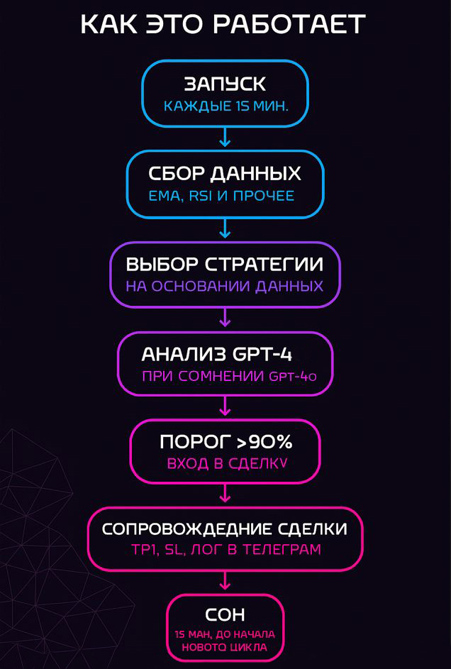
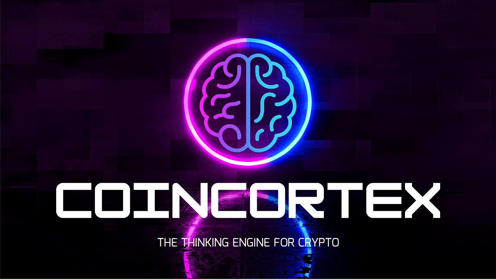
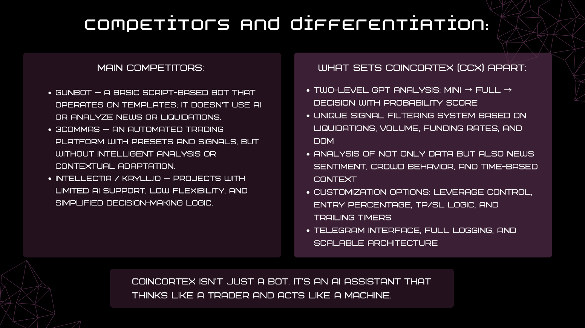
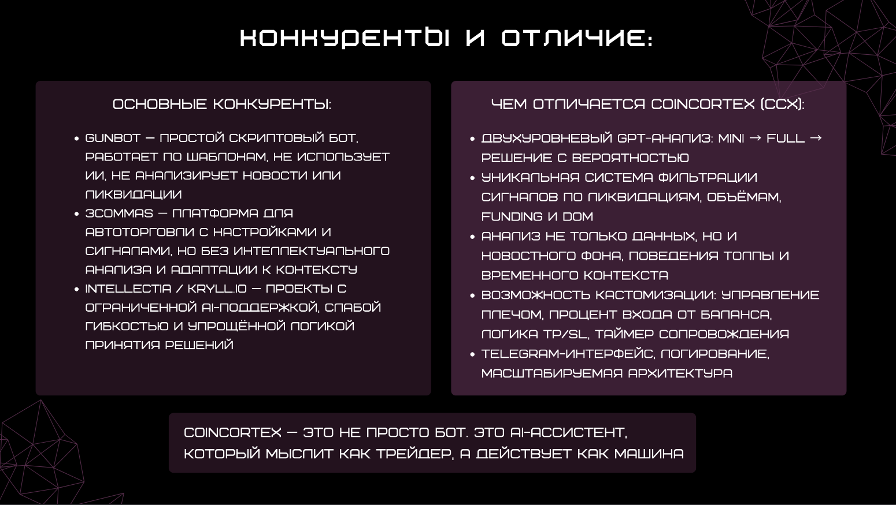

# CoinCortex — AI Assistant for Crypto Trading

CoinCortex is an intelligent AI-driven trading assistant that helps traders analyze market data, generate signals, and manage trades based on real-time information — not emotions.

## 🔍 Key Features
- GPT-based multi-layered signal analysis (Mini + 4O)
- Integration with Binance, CoinGlass, Hyblock
- DOM, RSI, EMA, Funding Rate, Liquidations, Whale Alerts, and News parsing
- Full Telegram interface with real-time logging
- Modular architecture ready for scaling and white-label use

## 📦 Folder Structure
- `/docs` — Pitch Deck (RU / EN)
- `/screenshots` — Telegram bot interface examples
- `/architecture` — Diagrams of bot architecture and flow
- `/readme_assets` — Images used in this README

## 🚀 Roadmap
- ✅ MVP with real trading logic
- 🔄 Integration with additional exchanges
- 🛠 Strategy marketplace (custom AI strategies)
- 📊 Advanced analytics dashboard

## 🧠 How It Works

Russian Version

---

## 🖼️ Visual Assets

## 📬 Contact
- Email: coincortex.bot@gmail.com
